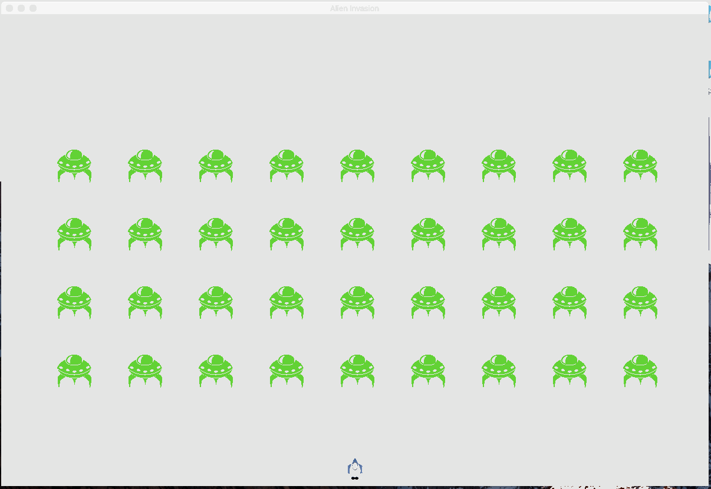

<!-- MarkdownTOC -->

- [1.外星人入侵](#1%E5%A4%96%E6%98%9F%E4%BA%BA%E5%85%A5%E4%BE%B5)
    - [1.武装飞船](#1%E6%AD%A6%E8%A3%85%E9%A3%9E%E8%88%B9)
        - [1.规划项目](#1%E8%A7%84%E5%88%92%E9%A1%B9%E7%9B%AE)
        - [2.安装Pygame](#2%E5%AE%89%E8%A3%85pygame)
        - [3.开始游戏项目](#3%E5%BC%80%E5%A7%8B%E6%B8%B8%E6%88%8F%E9%A1%B9%E7%9B%AE)
            - [1.创建Pygame窗口,并相应用户输入](#1%E5%88%9B%E5%BB%BApygame%E7%AA%97%E5%8F%A3%E5%B9%B6%E7%9B%B8%E5%BA%94%E7%94%A8%E6%88%B7%E8%BE%93%E5%85%A5)
            - [2.设置背景色](#2%E8%AE%BE%E7%BD%AE%E8%83%8C%E6%99%AF%E8%89%B2)
            - [3.创建设置相关的类](#3%E5%88%9B%E5%BB%BA%E8%AE%BE%E7%BD%AE%E7%9B%B8%E5%85%B3%E7%9A%84%E7%B1%BB)
        - [4.添加飞船图像](#4%E6%B7%BB%E5%8A%A0%E9%A3%9E%E8%88%B9%E5%9B%BE%E5%83%8F)
        - [5.重构:模块](#5%E9%87%8D%E6%9E%84%E6%A8%A1%E5%9D%97)
    - [2.驾驶飞船](#2%E9%A9%BE%E9%A9%B6%E9%A3%9E%E8%88%B9)
        - [1.按键响应](#1%E6%8C%89%E9%94%AE%E5%93%8D%E5%BA%94)
        - [2.实现飞船连续移动](#2%E5%AE%9E%E7%8E%B0%E9%A3%9E%E8%88%B9%E8%BF%9E%E7%BB%AD%E7%A7%BB%E5%8A%A8)
        - [3.限制移动范围](#3%E9%99%90%E5%88%B6%E7%A7%BB%E5%8A%A8%E8%8C%83%E5%9B%B4)
        - [4.重构:按键响应](#4%E9%87%8D%E6%9E%84%E6%8C%89%E9%94%AE%E5%93%8D%E5%BA%94)
    - [3.射击](#3%E5%B0%84%E5%87%BB)
        - [1.添加子弹设置](#1%E6%B7%BB%E5%8A%A0%E5%AD%90%E5%BC%B9%E8%AE%BE%E7%BD%AE)
        - [2.定义子弹类](#2%E5%AE%9A%E4%B9%89%E5%AD%90%E5%BC%B9%E7%B1%BB)
        - [3.主调函数子弹设置](#3%E4%B8%BB%E8%B0%83%E5%87%BD%E6%95%B0%E5%AD%90%E5%BC%B9%E8%AE%BE%E7%BD%AE)
        - [4.发射子弹](#4%E5%8F%91%E5%B0%84%E5%AD%90%E5%BC%B9)
        - [5.消除已经消失的子弹](#5%E6%B6%88%E9%99%A4%E5%B7%B2%E7%BB%8F%E6%B6%88%E5%A4%B1%E7%9A%84%E5%AD%90%E5%BC%B9)
        - [6.限制子弹数量](#6%E9%99%90%E5%88%B6%E5%AD%90%E5%BC%B9%E6%95%B0%E9%87%8F)
        - [7.提取update_bullets\(\)](#7%E6%8F%90%E5%8F%96updatebullets)
    - [4.外星人](#4%E5%A4%96%E6%98%9F%E4%BA%BA)
        - [1.使用q键退出游戏](#1%E4%BD%BF%E7%94%A8q%E9%94%AE%E9%80%80%E5%87%BA%E6%B8%B8%E6%88%8F)
        - [2.创建第一个外星人](#2%E5%88%9B%E5%BB%BA%E7%AC%AC%E4%B8%80%E4%B8%AA%E5%A4%96%E6%98%9F%E4%BA%BA)
        - [3.创建一群外星人](#3%E5%88%9B%E5%BB%BA%E4%B8%80%E7%BE%A4%E5%A4%96%E6%98%9F%E4%BA%BA)
        - [4.让外星人移动](#4%E8%AE%A9%E5%A4%96%E6%98%9F%E4%BA%BA%E7%A7%BB%E5%8A%A8)
        - [5.射杀外星人](#5%E5%B0%84%E6%9D%80%E5%A4%96%E6%98%9F%E4%BA%BA)
            - [1. 检查外星人与子弹的碰撞](#1-%E6%A3%80%E6%9F%A5%E5%A4%96%E6%98%9F%E4%BA%BA%E4%B8%8E%E5%AD%90%E5%BC%B9%E7%9A%84%E7%A2%B0%E6%92%9E)
        - [6.游戏结束](#6%E6%B8%B8%E6%88%8F%E7%BB%93%E6%9D%9F)
            - [1.检查外星人和飞船的碰撞](#1%E6%A3%80%E6%9F%A5%E5%A4%96%E6%98%9F%E4%BA%BA%E5%92%8C%E9%A3%9E%E8%88%B9%E7%9A%84%E7%A2%B0%E6%92%9E)
            - [2. 响应飞船和外星人的碰撞](#2-%E5%93%8D%E5%BA%94%E9%A3%9E%E8%88%B9%E5%92%8C%E5%A4%96%E6%98%9F%E4%BA%BA%E7%9A%84%E7%A2%B0%E6%92%9E)
            - [3.有外星人达到屏幕底部-失败](#3%E6%9C%89%E5%A4%96%E6%98%9F%E4%BA%BA%E8%BE%BE%E5%88%B0%E5%B1%8F%E5%B9%95%E5%BA%95%E9%83%A8-%E5%A4%B1%E8%B4%A5)
            - [4.游戏结束](#4%E6%B8%B8%E6%88%8F%E7%BB%93%E6%9D%9F)
    - [5.计分](#5%E8%AE%A1%E5%88%86)
        - [1.添加Play按钮](#1%E6%B7%BB%E5%8A%A0play%E6%8C%89%E9%92%AE)
            - [1.创建Button 类](#1%E5%88%9B%E5%BB%BAbutton-%E7%B1%BB)
            - [2.开始游戏](#2%E5%BC%80%E5%A7%8B%E6%B8%B8%E6%88%8F)
            - [3.游戏重置](#3%E6%B8%B8%E6%88%8F%E9%87%8D%E7%BD%AE)
        - [2.提高等级](#2%E6%8F%90%E9%AB%98%E7%AD%89%E7%BA%A7)
        - [3.计分](#3%E8%AE%A1%E5%88%86)

<!-- /MarkdownTOC -->


> 项目部分


# 1.外星人入侵
> 游戏《外星人入侵》将包含很多不同的文件，因此请在你的系统中新建一个文件夹，并
将其命名为alien_invasion。请务必将这个项目的所有文件都存储到这个文件夹中，这样
相关的import语句才能正确地工作。

- 效果

 


## 1.武装飞船

### 1.规划项目
- 创建 alien_invasion 文件夹

> 在游戏《外星人入侵》中，玩家控制着一艘最初出现在屏幕底部中央的飞船。玩家
可以使用箭头键左右移动飞船，还可使用空格键进行射击。游戏开始时，一群外星人出
现在天空中，他们在屏幕中向下移动。玩家的任务是射杀这些外星人。玩家将所有外星
人都消灭干净后，将出现一群新的外星人，他们移动的速度更快。只要有外星人撞到了
玩家的飞船或到达了屏幕底部，玩家就损失一艘飞船。玩家损失三艘飞船后，游戏结束。


### 2.安装Pygame

- linux : 先确认安装pip
`$ sudo apt-get install python-pygame`

> 执行如下命令，在终端会话中检查安装情况：

```
$ python
>>> import pygame
>>>
```

如果没有任何输出，就说明Python导入了Pygame，你可以跳到12.3节。
如果你使用的是Python 3，就需要执行两个步骤：安装Pygame依赖的库； 下载并安装Pygame。
执行下面的命令来安装Pygame依赖的库（如果你开始终端会话时使用的是命令python3.5，
请将python3-dev替换为python3.5-dev）：
```
$ sudo apt-get install python3-dev mercurial
$ sudo apt-get install libsdl-image1.2-dev libsdl2-dev libsdl-ttf2.0-dev
```
这将安装运行《外星人入侵》时需要的库。如果你要启用Pygame的一些高级功能，如添加
声音的功能，可安装下面这些额外的库：
```
$ sudo apt-get install libsdl-mixer1.2-dev libportmidi-dev
$ sudo apt-get install libswscale-dev libsmpeg-dev libavformat-dev libavcode-dev
$ sudo apt-get install python-numpy
```
接下来，执行下面的命令来安装Pygame（如有必要，将pip替换为pip3）：
`$ pip install --user hg+http://bitbucket.org/pygame/pygame`
告知你Pygame找到了哪些库后，输出将暂停一段时间。请按回车键，即便有一些库没有找
到。你将看到一条消息，说明成功地安装了Pygame。
要确认安装成功，请启动一个Python终端会话，并尝试执行下面的命令来导入Pygame：
```
$ python3
>>> import pygame
>>>
```


- windows 


- mac osx :
> 先确认安装pip
- python2 
```shell
chendeMacBook-Air-2:alien_invasion chen$ pip --version
pip 9.0.1 from /usr/local/lib/python2.7/site-packages (python 2.7)
```


- python3
```python
chendeMacBook-Air-2:alien_invasion chen$ pip3 --version
pip 9.0.1 from /usr/local/lib/python3.6/site-packages (python 3.6)
```


要安装Pygame依赖的有些包，需要Homebrew。如果你没有安装Homebrew，请参阅附录A的说明。
为安装Pygame依赖的库，请执行下面的命令：
`$ brew install hg sdl sdl_image sdl_ttf`
这将安装运行游戏《外星人入侵》所需的库。每安装一个库后，输出都会向上滚动。
如果你还想启用较高级的功能，如在游戏中包含声音，可安装下面两个额外的库：
`$ brew install sdl_mixer portmidi`
使用下面的命令来安装Pygame（如果你运行的是Python 2.7，请将pip3替换为pip）：
`$ pip3 install --user hg+http://bitbucket.org/pygame/pygame`  

启动一个Python终端会话，并导入Pygame以检查安装是否成功（如果你运行的是Python 2.7，
请将python3替换为python）：
```
$ python3
>>> import pygame
>>>
```


### 3.开始游戏项目

#### 1.创建Pygame窗口,并相应用户输入

> 说明:

- 导入需要的包  
    + sys
    + pygame
- 定义一个方法,初始化游戏
    + `run_game()`
        * 初始化屏幕对象`pygame.display.set_mode(`
        * 开始游戏主循环
            - 监视键盘和鼠标事件`pygame.event.get()`
            - 刷新屏幕`pygame.display.flip()`

        


```python
# 我们创建一个空的Pygame窗口

import sys

import pygame


def run_game():
    """初始化游戏,并创建一个屏幕对象"""
    pygame.init()
    screen = pygame.display.set_mode((1200,800))
    pygame.display.set_caption("Alien Invation")

    # 开始游戏主循环

    while True:
        # 监视键盘和鼠标事件
        for event in pygame.event.get():
            if event.type == pygame.QUIT:
                sys.exit()

        # 让最近绘制的屏幕可见
        pygame.display.flip()

run_game()
```


#### 2.设置背景色
> Pygame默认创建一个黑色屏幕


```python
# 我们创建一个空的Pygame窗口

import sys

import pygame


def run_game():
    """初始化游戏,并创建一个屏幕对象"""
    ...
    pygame.display.set_caption("Alien Invation")

    ## 设置背景色
    bg_color = (230,230,230) #浅灰色
    # 开始游戏主循环

    while True:
        # 监视键盘和鼠标事件
        ....

        # 让最近绘制的屏幕可见
        screen.fill(bg_color) #屏幕填充背景色
        pygame.display.flip()

run_game()
```


#### 3.创建设置相关的类

> 每次给游戏添加新功能时，通常也将引入一些新设置。下面来编写一个名为settings的模块，
其中包含一个名为Settings的类，用于将所有设置存储在一个地方，以免在代码中到处添加设置。
这样，我们就能传递一个设置对象，而不是众多不同的设置。另外，这让函数调用更简单，且在
项目增大时修改游戏的外观更容易：要修改游戏，只需修改settings.py中的一些值，而无需查找
散布在文件中的不同设置。

- setting.py


> 创建设置类 settings.py

```python
#设置相关的类
# -*- coding: utf-8 -*-

class Settings():
    """存储<<外星人入侵>> 的所有设置"""
    def __init__(self):
        """初始化游戏设置"""
        self.title = "Alien Invasion"
        self.screen_width = 1200
        self.screen_height = 800
        self.bg_color = (230,230,230)

        
```


> 使用设置类,设置游戏

```python 
 # 我们创建一个空的Pygame窗口

import sys

import pygame

#导入设置类

from settings import Settings

def run_game():
    """初始化游戏,并创建一个屏幕对象"""
    pygame.init()

    ai_settings = Settings()##实例化设置类

    screen = pygame.display.set_mode((ai_settings.screen_width,ai_settings.screen_height))


    pygame.display.set_caption(ai_settings.title)

    
    # 开始游戏主循环

    while True:
        # 监视键盘和鼠标事件
        for event in pygame.event.get():
            if event.type == pygame.QUIT:
                sys.exit()

        # 让最近绘制的屏幕可见
        screen.fill(ai_settings.bg_color)
        pygame.display.flip()

run_game()
```
 


### 4.添加飞船图像
- 常用网址:http://pixabay.com/
- 配套资源:https://www.nostarch.com/pythoncrashcourse/

> 创建ship 类 管理飞船的大部分行为

-  ship.py

```python
# 创建ship 类管理飞船的大部分行为
import pygame
class Ship():
    def __init__(self, screen):
        """初始化飞船,并设置其初始位置"""
        self.screen = screen
        """加载飞船图像,并获取其外接举行"""
        self.image = pygame.image.load('images/ship.bmp')
        self.rect = self.image.get_rect()
        self.screen_rect = screen.get_rect()
        # 将新飞船 放在屏幕底部中央
        self.rect.centerx = self.screen_rect.centerx
        self.rect.bottom = self.screen_rect.bottom
    def blitme(self):
        """在指定位置绘制飞船"""
        self.screen.blit(self.image,self.rect)
```

> 屏幕上绘制飞船 `alien_invasion.py`

- 导入飞船类 `from ship import Ship`
- 实例一个飞船 `ship = Ship(screen)#创建一艘飞船`
- 绘制飞船 ` ship.blitme()`


```python
# 我们创建一个空的Pygame窗口
import sys
import pygame
 #导入设置类
from settings import Settings
 #导入飞船类
from ship import Ship
def run_game():
    """初始化游戏,并创建一个屏幕对象"""
    pygame.init()
    ai_settings = Settings()##实例化设置类
    screen = pygame.display.set_mode((ai_settings.screen_width,ai_settings.screen_height))
    ship = Ship(screen)#创建一艘飞船
    pygame.display.set_caption(ai_settings.title)
    
    # 开始游戏主循环
    while True:
        # 监视键盘和鼠标事件
        for event in pygame.event.get():
            if event.type == pygame.QUIT:
                sys.exit()
        screen.fill(ai_settings.bg_color)
        ship.blitme()
        # 让最近绘制的屏幕可见
        pygame.display.flip()
run_game()
```

> 效果

 


### 5.重构:模块

> 函数

 - check_events() : 监测键盘鼠标事件`game_functions.py`
 - update_screen(): 更新屏幕界面


> 功能模块`game_functions`

```python
# -*- coding: utf-8 -*-

# 监测事件的模块

import sys

import pygame

def check_events():
    """响应键盘和鼠标事件"""
    for event in pygame.event.get():
        if event.type == pygame.QUIT:
            sys.exit()

def update_screen(ai_settings,screen,ship):
    """更新屏幕界面,更新屏幕图像,并切换到新的屏幕"""
    # 每次循环都需要重新绘制屏幕
    screen.fill(ai_settings.bg_color)
    ship.blitme()

    # 让新绘制的屏幕可见
    pygame.display.flip()

```


> 主函数 `alien_invasion.py`


```python
# 我们创建一个空的Pygame窗口

import pygame

 #导入设置类
from settings import Settings


 #导入飞船类
from ship import Ship


# 导入事件模块
import game_functions as gf

def run_game():
    """初始化游戏,并创建一个屏幕对象"""
    pygame.init()

    ai_settings = Settings()##实例化设置类

    screen = pygame.display.set_mode((ai_settings.screen_width,ai_settings.screen_height))

    ship = Ship(screen)#创建一艘飞船

    pygame.display.set_caption(ai_settings.title)

    
    # 开始游戏主循环

    while True:
        # 监视键盘和鼠标事件
        gf.check_events()
        #更新屏幕
        gf.update_screen(ai_settings, screen, ship)

run_game()
```


## 2.驾驶飞船
> 实现飞船的左右移动,用户按下左右箭头,做出相应

### 1.按键响应

每当用户按键时，都将在Pygame中注册一个事件。事件都是通过方法pygame.event.get()获取的，因此在函数check_events()中，我们需要指定要检查哪些类型的事件。每次按键都被注册为一个KEYDOWN事件。检测到KEYDOWN事件时，我们需要检查按下的是否是特定的键。例如，如果按下的是右箭头键，我们就增大飞船的rect.centerx值，将飞船向右移动


- game_functions.py 中添加按键检查逻辑,实现飞船的左右移动 
- alien_invasion.py 中调用按键检查函数

```python
def check_events(ship):
    """响应键盘和鼠标事件"""
    for event in pygame.event.get():
        if event.type == pygame.QUIT:
            sys.exit()

        elif event.type == pygame.KEYDOWN:
            if event.key == pygame.K_RIGHT:
                #向右移动飞船
                ship.rect.centerx+=1
```

```python
    # 开始游戏主循环

    while True:
        # 监视键盘和鼠标事件
        gf.check_events(ship) #传入ship
        #更新屏幕
        gf.update_screen(ai_settings, screen, ship)
```


### 2.实现飞船连续移动
> 需求:当按键按下时,飞船连续移动,松开时,取消移动

- ship.py

```python
# 创建ship 类管理飞船的大部分行为


import pygame


class Ship():
    def __init__(self, screen):
        """初始化飞船,并设置其初始位置"""
        self.screen = screen
        """加载飞船图像,并获取其外接举行"""

        self.image = pygame.image.load('images/ship.bmp')
        self.rect = self.image.get_rect()
        self.screen_rect = screen.get_rect()


        self.move_step = 10 #左右移动步长

        #移动标志位
        self.moving_right = False
        self.moving_left = False


        # 将新飞船 放在屏幕底部中央
        self.rect.centerx = self.screen_rect.centerx
        self.rect.bottom = self.screen_rect.bottom

    def blitme(self):
        """在指定位置绘制飞船"""
        self.screen.blit(self.image,self.rect)


    def update(self):
        """根据移动标志位,调整飞船位置"""
        if self.moving_right:
            self.rect.centerx +=self.move_step
        if self.moving_left:
            self.rect.centerx -=self.move_step
```


- game_functions.py

```python
# -*- coding: utf-8 -*-

# 监测事件的模块

import sys

import pygame

def check_events(ship):
    """响应键盘和鼠标事件"""
    for event in pygame.event.get():
        if event.type == pygame.QUIT:
            sys.exit()

        elif event.type == pygame.KEYDOWN:
            if event.key == pygame.K_RIGHT:
                #将飞船的moving_right 标志位设为True
                ship.moving_right = True
            elif event.key ==pygame.K_LEFT:
                ship.moving_left = True


        elif event.type == pygame.KEYUP:
            if event.key ==pygame.K_RIGHT:
                ship.moving_right = False
            if event.key ==pygame.K_LEFT:
                ship.moving_left = False

                    

def update_screen(ai_settings,screen,ship):
    """更新屏幕界面,更新屏幕图像,并切换到新的屏幕"""
    # 每次循环都需要重新绘制屏幕
    screen.fill(ai_settings.bg_color)
    ship.blitme()

    # 让新绘制的屏幕可见
    pygame.display.flip()


```

- alien_invasion.py

```python

    while True:
        # 监视键盘和鼠标事件
        gf.check_events(ship)
        ship.update()
        #更新屏幕
        gf.update_screen(ai_settings, screen, ship)
```

### 3.限制移动范围

```python

    def update(self):
        """根据移动标志位,调整飞船位置"""
        if self.moving_right :
            self.rect.centerx +=self.move_step

            if self.rect.centerx > self.screen_rect.right:
                self.rect.centerx = self.screen_rect.right

        if self.moving_left:
            self.rect.centerx -=self.move_step

            if self.rect.centerx < 0:
                self.rect.centerx = 0

```

### 4.重构:按键响应

```python

def check_events(ship):
    """响应键盘和鼠标事件"""
    for event in pygame.event.get():
        if event.type == pygame.QUIT:
            sys.exit()

        elif event.type == pygame.KEYDOWN:
            check_keydown_events(event, ship)  # 按键按下

        elif event.type == pygame.KEYUP:
            check_keyup_events(event, ship)


# 重构: 响应按键按下

def check_keydown_events(event, ship):
    """重构: 响应按键按下"""
    if event.key == pygame.K_RIGHT:
        # 将飞船的moving_right 标志位设为True
        ship.moving_right = True
    elif event.key == pygame.K_LEFT:
        ship.moving_left = True


# 重构: 响应按键松开

def check_keyup_events(event, ship):
    """响应按键松开"""
    if event.key == pygame.K_RIGHT:
        ship.moving_right = False
    elif event.key ==pygame.K_LEFT:
        ship.moving_left = False
```

## 3.射击
> 下面来添加射击功能。我们将编写玩家按空格键时发射子弹（小矩形）的代码。子弹将在屏
幕中向上穿行，抵达屏幕上边缘后消失。

### 1.添加子弹设置

> settings.py

```python 
#设置相关的类
# -*- coding: utf-8 -*-

class Settings():
    """存储<<外星人入侵>> 的所有设置"""
    def __init__(self):
        """初始化游戏设置"""
        self.title = "Alien Invasion"
        self.screen_width = 1200
        self.screen_height = 800
        self.bg_color = (230,230,230)

        # 子弹设置
        self.bullet_speed_factor = 5
        self.bullet_width = 3
        self.bullet_height = 15
        self.bullet_color = 60,60,60
```

### 2.定义子弹类

> bullet.py

```python 
# -*- coding: utf-8 -*-

# 子弹类

import pygame 
from pygame.sprite import Sprite

class  Bullet(Sprite):
    """飞船发送的子弹管理的类"""
    def __init__(self, ai_settings,screen,ship):
        super( Bullet, self).__init__()
        self.screen = screen
        
        # 在(0,0)处 创建一个表示子弹的矩形,在设置正确的位置
        self.rect = pygame.Rect(0,0,ai_settings.bullet_width,ai_settings.bullet_height)

        self.rect.centerx = ship.rect.centerx
        self.rect.top = ship.rect.top

        # 存储用小数点表示的子弹位置
        self.y = float(self.rect.y) 

        # 设置颜色和速度
        self.color = ai_settings.bullet_color
        self.speed_factor = ai_settings.bullet_speed_factor
        
    def update(self):
        """向上移动子弹"""
        self.y -= self.speed_factor
        self.rect.y = self.y

    def draw_bullet(self):
        """屏幕上 绘制子弹"""
        pygame.draw.rect(self.screen,self.color,self.rect)

```


### 3.主调函数子弹设置

> alien_invasion.py

- 添加子弹到数组
- 更新视图绘制


```python
# 我们创建一个空的Pygame窗口

import pygame

 #导入设置类
from settings import Settings


 #导入飞船类
from ship import Ship


# 导入事件模块
import game_functions as gf


# 导入编组,管理子弹

from pygame.sprite import Group


def run_game():
    """初始化游戏,并创建一个屏幕对象"""
    pygame.init()

    ai_settings = Settings()##实例化设置类

    screen = pygame.display.set_mode((ai_settings.screen_width,ai_settings.screen_height))

    #创建一艘飞船
    ship = Ship(screen)

    #将子弹添加到数组中
    bullets = Group()


    #设置标题
    pygame.display.set_caption(ai_settings.title)
    
    # 开始游戏主循环
    while True:
        # 监视键盘和鼠标事件
        gf.check_events(ai_settings,screen,ship,bullets)
        ship.update()
        bullets.update() #更新子弹
        #更新屏幕
        gf.update_screen(ai_settings, screen, ship,bullets)

run_game()


```


### 4.发射子弹

> game_functions.py

- 监测按键
- 更新

```python
# 重构: 响应按键按下
def check_keydown_events(event, ai_settings,screen,ship,bullets):
    """重构: 响应按键按下"""
    if event.key == pygame.K_RIGHT:
        # 将飞船的moving_right 标志位设为True
        ship.moving_right = True
    elif event.key == pygame.K_LEFT:
        ship.moving_left = True

    elif event.key ==pygame.K_SPACE:
        #创建一个子弹,并加入到bullets中
        new_bullet = Bullet(ai_settings,screen,ship)
        bullets.add(new_bullet)

```


```python
def update_screen(ai_settings, screen, ship,bullets):
    """更新屏幕界面,更新屏幕图像,并切换到新的屏幕"""
    # 每次循环都需要重新绘制屏幕
    screen.fill(ai_settings.bg_color)
    # 在飞船和外星人后面绘制所有子弹
    for bullet in bullets.sprites():
        bullet.draw_bullet()

    ship.blitme()


    # 让新绘制的屏幕可见
    pygame.display.flip()

```


### 5.消除已经消失的子弹

> 若子弹的rect的bottom属性为零，它表明子弹已穿过屏幕顶端

```python
    # 开始游戏主循环
    while True:
        # 监视键盘和鼠标事件
        gf.check_events(ai_settings,screen,ship,bullets)
        ship.update()
        
        #子弹更新
        bullets.update()
        
        # 删除消失的子弹
        for bullet in bullets.copy():
            if bullet.rect.bottom <=0:
                bullets.remove(bullet)
        print(len(bullets))


        #更新屏幕
        gf.update_screen(ai_settings, screen, ship,bullets)

```


### 6.限制子弹数量

- settings.py
```
        #限制子弹的数量
        self.bullets_allowed = 10 

```

- game_functions.py
```python
    elif event.key ==pygame.K_SPACE:
        #创建一个子弹,并加入到bullets中
        if len(bullets)< ai_settings.bullets_allowed :#限制子弹数量
            new_bullet = Bullet(ai_settings,screen,ship)
            bullets.add(new_bullet)
```


### 7.提取update_bullets()

> alien_invasion.py

```python
    # 开始游戏主循环
    while True:
        # 监视键盘和鼠标事件
        gf.check_events(ai_settings,screen,ship,bullets)
        ship.update()

        #提取update_bullets()
        gf.update_bullets(bullets)

        #更新屏幕
        gf.update_screen(ai_settings, screen, ship,bullets)
```

> game_functions.py

```python

# 提取子弹更新函数
def update_bullets(bullets):
    """更新子弹位置,删除消失的子弹"""
    bullets.update()
    # 删除消失的子弹
    for bullet in bullets.copy():
        if bullet.rect.bottom <=0:
            bullets.remove(bullet)
    print(len(bullets))
```


## 4.外星人

### 1.使用q键退出游戏
```python
# 重构: 响应按键按下
def check_keydown_events(event, ai_settings,screen,ship,bullets):
    """重构: 响应按键按下"""
    if event.key == pygame.K_RIGHT:
       .....
    # 按下q退出游戏
    elif event.key == pygame.K_q:
        sys.exit()  

```


### 2.创建第一个外星人
- 创建一个外星人类alien.py
- 主函数实例化一个外星人
- 功能函数跟新界面update_screen

> alien.py

```python
# -*- coding: utf-8 -*-

# 外星人对应的类

import pygame

from pygame.sprite import Sprite

class Alien(Sprite):
    """表示单个外星人的类"""

    def __init__(self, ai_settings,screen):
        super(Alien, self).__init__()
        self.ai_settings = ai_settings
        self.screen = screen
        
        # 加载外星人图片
        self.image = pygame.image.load('images/alien.bmp')
        self.rect = self.image.get_rect()

        # 初始化:每个外星人最初都在屏幕左上角附近
        # self.rect.x = self.rect.width
        # self.rect.y = self.rect.height
        self.rect.x = self.rect.width
        self.rect.y = 0

        # 存储外星人的准确位置
        self.x = float(self.rect.x)
    def blitme(self):
        """在指定位置绘制外星人"""
        self.screen.blit(self.image,self.rect)

```

> alien_invasion.py

```python
# 我们创建一个空的Pygame窗口
...
# 导入外星人
from alien import Alien

def run_game():
    """初始化游戏,并创建一个屏幕对象"""
    ......

    #创建一艘飞船
    ship = Ship(screen)

    # 创建一个外星人的实例
    alien = Alien(ai_settings, screen)
    #将子弹添加到数组中
    ...

    #设置标题
    ...
    
    # 开始游戏主循环
    while True:
        # 监视键盘和鼠标事件
        ...
        #更新屏幕
        gf.update_screen(ai_settings, screen, ship,alien,bullets)
run_game()

```

> game_functions.py

```python

def update_screen(ai_settings, screen, ship,alien,bullets):
    """更新屏幕界面,更新屏幕图像,并切换到新的屏幕"""
    # 每次循环都需要重新绘制屏幕
    screen.fill(ai_settings.bg_color)
    # 在飞船和外星人后面绘制所有子弹
    for bullet in bullets.sprites():
        bullet.draw_bullet()

    ship.blitme()
    alien.blitme()# 绘制外星人
    # 让新绘制的屏幕可见
    pygame.display.flip()

```

### 3.创建一群外星人

- 确定一行可以容纳几个外星人?
- 创建多行外星人
- 创建外星人群
- 重构create_fleet
- 添加行


```python


# 创建外星人群
def create_fleet(ai_settings,screen,ship,aliens):
    """创建外星人群"""
    # 创建一个外星人,并计算一行可以容纳多少个
    # 外星人的间隔为外星人的宽度
    alien = Alien(ai_settings, screen)
    alien_width = alien.rect.width

    ##获取一行可以创建的外星人的个数
    number_aliens_x = get_number_aliens_x(ai_settings,alien_width)
    number_rows = get_number_rows(ai_settings, ship.rect.height, alien.rect.height)


    # 创建多行外星人

    for row_number in range(number_rows):
        # 创建第一行外星人
        for alien_number in range(number_aliens_x):
            create_alien(ai_settings,screen,aliens,alien_number,row_number)


# 获取一行可以创建的外星人的个数

def get_number_aliens_x(ai_settings,alien_width):
    avilable_space_x = ai_settings.screen_width - 2* alien_width
    number_aliens_x = int(avilable_space_x/(2*alien_width))
    return number_aliens_x


# 创建指定行的第i个外星人
def create_alien(ai_settings,screen,aliens,alien_number,row_number):
    """创建一个外星人,并放在当前行"""
    alien = Alien(ai_settings, screen)
    alien_width = alien.rect.width
    alien.x = alien_width+2*alien_width*alien_number
    alien.rect.x = alien.x

    # 设置飞船的y坐标
    alien.rect.y = alien.rect.height + 2 * alien.rect.height * row_number

    aliens.add(alien)


# 计算屏幕能容纳的外星人飞船的行数

def get_number_rows(ai_settings,ship_height,alien_height):
    """计算屏幕可以容纳外星人飞船的行数"""
    available_space_y = (ai_settings.screen_height - (3*alien_height) - ship_height)
    number_rows = int(available_space_y/(2*alien_height))
    return number_rows


```

> alien_invasion.py

```python
    # 创建外星人群
    # gf.create_fleet(ai_settings,screen,aliens)
    gf.create_fleet(ai_settings, screen, ship, aliens)
```


> 效果

### 4.让外星人移动
> 让外星人群在屏幕上向右移动，撞到屏幕边缘后下移一定的距离，再沿相反的方向移
动。我们将不断地移动所有的外星人，直到所有外星人都被消灭，有外星人撞上飞船，或有外星
人抵达屏幕底端

- 设置移动速度
> settings.py

```python
        #设置外星人移动速度
        self.alien_speed_factor = 1
```


- 向右移动外星人

>  alien.py

```python
def update(self):
        """向右移动外星人"""
        self.x+=self.ai_settings.alien_speed_factor
        self.rect.x = self.x

```

- 主程序更新

> alien_invasion.py

```python

    # 开始游戏主循环
    while True:
        # 监视键盘和鼠标事件
        gf.check_events(ai_settings,screen,ship,bullets)
        ship.update()

        #提取update_bullets()
        gf.update_bullets(bullets)

        # 外星人移动
        gf.update_aliens(aliens)

        #更新屏幕
        gf.update_screen(ai_settings, screen, ship,aliens,bullets)

```

- 设置移动方向

```python
        #设置外星人移动速度
        self.alien_speed_factor = 1
        self.fleet_drop_speed = 10 #撞到屏幕边缘后向下移动
        self.fleet_direction = 1 # 移动方向 1-向右 -1 向左
```


- 检查是否移动到边缘

> alien.py

```python
    def check_fleet_edges(self):
        """如果外星人位于屏幕的边缘,返回True"""
        screen_rect = self.screen.get_rect()
        if self.rect.right >= screen_rect.right:
            return True
        elif self.rect.left <=0:
            return True
```


> game_functions.py

```python

# 外星人移动 - 检查是否有外星人位于边缘
def update_aliens(ai_settings,aliens):
    """更新外星人位置"""
    check_fleet_edges(ai_settings, aliens)
    aliens.update()


# 检查,如果有外星人到达边缘是,改变移动方向,并向下移动外星人
def check_fleet_edges(ai_settings,aliens):
    """有外星人到达边缘时,采取相应措施"""
    for alien in aliens.sprites():
        if alien.check_fleet_edges():
            change_fleet_direction(ai_settings,aliens)
            break

def change_fleet_direction(ai_settings,aliens):
    """将整群外星人下移,并改变左右移动方向"""
    for alien  in aliens.sprites():
        alien.rect.y += ai_settings.fleet_drop_speed
    ai_settings.fleet_direction *=-1
```

> alien_invasion.py

```python
        # 外星人移动
        gf.update_aliens(ai_settings,aliens)
```


 

### 5.射杀外星人
> 我们将使用 `sprite.groupcollide()` 检测两个编组的成员之间的碰撞

#### 1. 检查外星人与子弹的碰撞
> 更新子弹位置后检查碰撞

- 方法sprite.groupcollide()将每颗子弹的rect同每个外星人的rect进行比较，并返回一个字
典，其中包含发生了碰撞的子弹和外星人。在这个字典中，每个键都是一颗子弹，而相应的值都
是被击中的外星人（第14章实现记分系统时，也会用到这个字典）

- update_bullets() 中检查碰撞

> 检查碰撞,并删除碰撞的外星人和子弹 `game_functions.py`


```python
# 提取子弹更新函数- 检查子弹与汪星人的碰撞
def update_bullets(aliens,bullets):
    """更新子弹位置,删除消失的子弹"""
    bullets.update()
    # 删除消失的子弹
    for bullet in bullets.copy():
        if bullet.rect.bottom <=0:
            bullets.remove(bullet)
    print(len(bullets))

    # 检查是否有子弹击中外星人
    # 若果有,则删除响应的子弹和外星人

    collisions = pygame.sprite.groupcollide(bullets,aliens,True,True)

```

```python

        #提取update_bullets() - 更新子弹位置时检查碰撞
        gf.update_bullets(aliens,bullets)
```


2. 生成新的外星人群

> 这个游戏的一个重要特点是外星人无穷无尽，一个外星人群被消灭后，又会出现一群外星人。 -->
要在外星人群被消灭后又显示一群外星人，首先需要检查编组aliens是否为空。如果为空，
就调用create_fleet()。我们将在update_bullets()中执行这种检查，因为外星人都是在这里被
消灭的：

> game_functions.py

```python
# 提取子弹更新函数- 检查子弹与汪星人的碰撞
def update_bullets(ai_settings,screen,ship,aliens,bullets):
    """更新子弹位置,删除消失的子弹"""
    bullets.update()
    # 删除消失的子弹
    for bullet in bullets.copy():
        if bullet.rect.bottom <=0:
            bullets.remove(bullet)
    print(len(bullets))

    # 检查是否有子弹击中外星人
    # 若果有,则删除响应的子弹和外星人
    collisions = pygame.sprite.groupcollide(bullets,aliens,True,True)

    # 创建新的外星人群
    if len(aliens) == 0 :
        # 删除现有的子弹,并新创建一群外星人
        bullets.empty()
        create_fleet(ai_settings, screen, ship, aliens)
```

> alien_invasion.py : 形参改变

```python
    #提取update_bullets() - 更新子弹位置时检查碰撞
        gf.update_bullets(ai_settings,screen,ship,aliens,bullets)
```

### 6.游戏结束
#### 1.检查外星人和飞船的碰撞
> 更新每个外星人的位置后立即检测外星人和飞船之间的碰撞

- game_functions.py

```python

# 外星人移动 - 检查是否有外星人位于边缘
def update_aliens(ai_settings,ship,aliens):
    """更新外星人位置"""
    check_fleet_edges(ai_settings, aliens)
    aliens.update()


    # 检查飞船和外星人间的碰撞

    if pygame.sprite.spritecollideany(ship,aliens):
        print("ship hit !!!")
```


-  alien_invasion.py
```python
        # 外星人移动
        gf.update_aliens(ai_settings,ship,aliens)
```


#### 2. 响应飞船和外星人的碰撞
> 现在需要确定外星人与飞船发生碰撞时，该做些什么。我们不销毁ship实例并创建一个新的
ship实例，而是通过跟踪游戏的统计信息来记录飞船被撞了多少次（跟踪统计信息还有助于记
分）。

- 下 面 来 编 写 一 个 用 于 跟 踪 游 戏 统 计 信 息 的 新 类 ——GameStats ， 并 将 其 保 存 为 文 件

> game_stats.py：

```python
# -*- coding: utf-8 -*-

class GameStats():
    """跟踪游戏的统计信息"""
    def __init__(self, ai_settings):
        """初始化统计信息"""
        self.ai_settings = ai_settings
        self.reset_stats()

    def reset_stats(self):
        """初始化游戏运行期间可能发生变化的统计信息"""
        self.ships_left = self.ai_settings.ship_limit #剩余的可用的飞船
```


 > setting.py

 ```python
        # 玩家的飞船设置

        self.ship_speed_factor = 1 #玩家的飞船移动速度
        self.ship_limit = 3 #玩家拥有的飞船数
 ```

> alien_invasion.py 

```python

def run_game():
    
    ...
    #设置标题
    pygame.display.set_caption(ai_settings.title)

    # 创建一个用于存储游戏状态的统计信息实例
    stats = GameStats(ai_settings)
    
    # 开始游戏主循环
    while True:
        ...
        gf.update_bullets(ai_settings,screen,ship,aliens,bullets)

        # 外星人移动
        gf.update_aliens(ai_settings,stats,screen,ship,aliens,bullets)
        ...

```

> game_functions.py

```python


# 外星人移动 - 检查是否有外星人位于边缘
def update_aliens(ai_settings,stats,screen,ship,aliens,bullets):
    """更新外星人位置"""
    check_fleet_edges(ai_settings, aliens)
    aliens.update()


    # 检查飞船和外星人间的碰撞
    if pygame.sprite.spritecollideany(ship,aliens):
        ship_hit(ai_settings,stats,screen,ship,aliens,bullets)


def ship_hit(ai_settings,stats,screen,ship,aliens,bullets):
    """响应飞船和外星人碰撞"""
    # 将ships_left -1 
    stats.ships_left -=1 # 玩家可用飞船个数-1
    # 清空外星人列表和子弹列表
    aliens.empty()
    bullets.empty()

    # 创建一群新的外星人,并将飞船放到屏幕底部中央
    create_fleet(ai_settings, screen, ship, aliens)
    ship.center_ship()

    # 暂停
    sleep(0.5)
```

#### 3.有外星人达到屏幕底部-失败

```python
def check_aliens_bottom(ai_settings,stats,screen,ship,aliens,bullets):
    """检查是否有外星人达到屏幕底端"""
    screen_rect = screen.get_rect()
    for alien in aliens.sprites():
        if alien.rect.bottom >= screen_rect.bottom:
            # 与飞船碰撞左同样处理
            ship_hit(ai_settings, stats, screen, ship, aliens, bullets)
            break
```

#### 4.游戏结束

> game_stats.py：

```python
# -*- coding: utf-8 -*-

class GameStats():
    """跟踪游戏的统计信息"""
    def __init__(self, ai_settings):
        """初始化统计信息"""
        self.ai_settings = ai_settings
        self.reset_stats()
        self.game_active = True# 游戏是否结束标志


    def reset_stats(self):
        """初始化游戏运行期间可能发生变化的统计信息"""
        self.ships_left = self.ai_settings.ship_limit #剩余的可用的飞船

```

> 碰撞时检查是否需要结束游戏

```python

def ship_hit(ai_settings,stats,screen,ship,aliens,bullets):
    """响应飞船和外星人碰撞"""
    # 判断游戏是否可以继续进行

    if stats.ships_left > 0:
        # 将ships_left -1 
        stats.ships_left -=1 # 玩家可用飞船个数-1
        # 清空外星人列表和子弹列表
        aliens.empty()
        bullets.empty()

        # 创建一群新的外星人,并将飞船放到屏幕底部中央
        create_fleet(ai_settings, screen, ship, aliens)
        ship.center_ship()


        # 暂停
        sleep(0.5)
        
    else:
        stats.game_active = False

```

> alien_invasion.py

```python
    # 开始游戏主循环
    while True:
        # 监视键盘和鼠标事件
        gf.check_events(ai_settings,screen,ship,bullets)

        if stats.game_active:

            ship.update()

            #提取update_bullets() - 更新子弹位置时检查碰撞
            gf.update_bullets(ai_settings,screen,ship,aliens,bullets)

            # 外星人移动
            gf.update_aliens(ai_settings,stats,screen,ship,aliens,bullets)
        #更新屏幕
        gf.update_screen(ai_settings, screen, ship,aliens,bullets)
```


## 5.计分

### 1.添加Play按钮
> 添加一个Play按钮，它在游戏开始前出现，并在游戏结束后再次出现，让玩家能够开始新游戏。

#### 1.创建Button 类

> button.py

```python
# -*- coding: utf-8 -*-
import pygame.font
class  Button():
    def __init__(self, ai_settings,screen,msg):
        """初始化play按钮属性"""
        self.screen = screen
        self.screen_rect = screen.get_rect()

        # 设置按钮尺寸和其他属性
        self.width,self.height = 200,50
        self.button_color = (0,255,0)
        self.text_color = (255,255,255)
        self.font = pygame.font.SysFont(None,48)

        # 创建按钮的rect 对象,并使其居中
        self.rect = pygame.Rect(0,0,self.width,self.height)
        self.rect.center = self.screen_rect.center

        # 按钮的标签只需要创建一次
        self.prep_msg(msg)

    def prep_msg(self,msg):
        """将msg渲染为图像,并使其在按钮上居中"""
        self.msg_image = self.font.render(msg,True,self.text_color,self.button_color)
        self.msg_image_rect = self.msg_image.get_rect()
        self.msg_image_rect.center = self.rect.center;

    def draw_button(self):
        """绘制一个使用颜色填充的按钮,在绘制文本"""
        self.screen.fill(self.button_color,self.rect) #绘制表示按钮的矩形
        self.screen.blit(self.msg_image,self.msg_image_rect) # 传递图片和rect
```


> game_stats.py：

`       self.game_active = False    # 游戏是否结束标志`


> alien_invasion.py

```python
# 我们创建一个空的Pygame窗口
....

# 导入button
from button import Button


def run_game():
    """初始化游戏,并创建一个屏幕对象"""
    
    ....
    # 创建play按钮
    play_button = Button(ai_settings, screen, "Play")

    # 创建一个用于存储游戏状态的统计信息实例
    stats = GameStats(ai_settings)
    
    # 开始游戏主循环
    while True:
        ....
            # 外星人移动
            gf.update_aliens(ai_settings,stats,screen,ship,aliens,bullets)
        #更新屏幕
        gf.update_screen(ai_settings, screen, stats,ship,aliens,bullets,play_button)
run_game()
```


> game_functions.py

```python
def update_screen(ai_settings, screen, stats,ship,aliens,bullets,play_button):
    """更新屏幕界面,更新屏幕图像,并切换到新的屏幕"""
    # 每次循环都需要重新绘制屏幕
    screen.fill(ai_settings.bg_color)
    # 在飞船和外星人后面绘制所有子弹
    for bullet in bullets.sprites():
        bullet.draw_bullet()
    ship.blitme()
    aliens.draw(screen)
    # 如果游戏处于非活动状态,绘制Play按钮
    if not stats.game_active:
        play_button.draw_button()

    # 让新绘制的屏幕可见
    pygame.display.flip()

```

 


#### 2.开始游戏
> 玩家单击Play按钮时开始新游戏，需在game_functions.py中添加如下代码，以监视与这个按钮相关的鼠标事件：

> 监听play 点击 `game_functions.py`

```python

def check_events(ai_settings,screen,stats,play_button,ship,bullets):
    """响应键盘和鼠标事件"""
    for event in pygame.event.get():
        if event.type == pygame.QUIT:
            sys.exit()

        elif event.type == pygame.KEYDOWN:
            check_keydown_events(event, ai_settings,screen,ship,bullets)  # 按键按下

        elif event.type == pygame.KEYUP:
            check_keyup_events(event, ai_settings,screen,ship,bullets)

        elif event.type == pygame.MOUSEBUTTONDOWN:#检查鼠标按下时是否点击play按钮    
            mouse_x,mouse_y = pygame.mouse.get_pos()
            check_play_button(stats,play_button,mouse_x,mouse_y)

def check_play_button(stats,play_button,mouse_x,mouse_y):
    """玩家单机Play按钮时,开始新的游戏"""
    if play_button.rect.collidepoint(mouse_x,mouse_y):
        stats.game_active = True
```


> alien_invasion.py

```python
    while True:
        # 监视键盘和鼠标事件
        gf.check_events(ai_settings,screen,stats,play_button,ship,bullets)

```

#### 3.游戏重置
> 每次单击Play按钮时都重置游戏，需要重置统计信息、删除现有的外星人和子弹、创建一群新的外星人，并让飞船居中

```
def check_play_button(ai_settings,screen,stats,play_button,ship,aliens,bullets,mouse_x,mouse_y):
    """玩家单机Play按钮时,开始新的游戏"""


    button_clicked =  play_button.rect.collidepoint(mouse_x,mouse_y)
    if button_clicked and not stats.game_active: #只有非active 状态下点击按钮才有效
        # 隐藏光标
        pygame.mouse.set_visible(False)

        # 重置游戏
        stats.reset_stats()
        stats.game_active = True

        # 清空外星人列表和子弹列表  
        aliens.empty()
        bullets.empty()

        # 创建一群新的外星人
        create_fleet(ai_settings, screen, ship, aliens)
        ship.center_ship()


def check_play_button(ai_settings,screen,stats,play_button,ship,aliens,bullets,mouse_x,mouse_y):
    """玩家单机Play按钮时,开始新的游戏"""


    button_clicked =  play_button.rect.collidepoint(mouse_x,mouse_y)
    if button_clicked and not stats.game_active: #只有非active 状态下点击按钮才有效
        # 隐藏光标
        pygame.mouse.set_visible(False)

        # 重置游戏
        stats.reset_stats()
        stats.game_active = True

        # 清空外星人列表和子弹列表  
        aliens.empty()
        bullets.empty()

        # 创建一群新的外星人
        create_fleet(ai_settings, screen, ship, aliens)
        ship.center_ship()

```

> 光标可见

```python
def ship_hit(ai_settings,stats,screen,ship,aliens,bullets):
    """响应飞船和外星人碰撞"""
    # 判断游戏是否可以继续进行

    if stats.ships_left > 0:
        # 将ships_left -1 
        stats.ships_left -=1 # 玩家可用飞船个数-1
        # 清空外星人列表和子弹列表
        aliens.empty()
        bullets.empty()

        # 创建一群新的外星人,并将飞船放到屏幕底部中央
        create_fleet(ai_settings, screen, ship, aliens)
        ship.center_ship()


        # 暂停
        sleep(0.5)
        
    else:
        stats.game_active = False
        
        # 光标可见
        pygame.mouse.set_visible(True)

```


### 2.提高等级

> 将整群外星人都消灭干净后，玩家将提高一个等级

```python 
#设置相关的类
# -*- coding: utf-8 -*-

class Settings():
    """存储<<外星人入侵>> 的所有设置"""
    def __init__(self):
        """初始化游戏设置"""
        self.title = "Alien Invasion"
        self.screen_width = 1200
        self.screen_height = 800
        self.bg_color = (230,230,230)

        # 子弹设置
        self.bullet_speed_factor = 5
        self.bullet_width = 300
        self.bullet_height = 15
        self.bullet_color = 60,60,60
        
        #限制子弹的数量
        self.bullets_allowed = 10 

        #设置外星人移动速度
        self.alien_speed_factor = 5
        self.fleet_drop_speed = 10 #撞到屏幕边缘后向下移动
        self.fleet_direction = 1 # 移动方向 1-向右 -1 向左


        # 玩家的飞船设置

        self.ship_speed_factor = 10 #玩家的飞船移动速度
        self.ship_limit = 3 #玩家拥有的飞船数
    
        # 设置游戏速度加快节奏

        self.speedup_scale = 1.1
        self.initialize_dynamic_settings()
    def initialize_dynamic_settings(self):
        """初始化随游戏进行改变的设置"""
        self.ship_speed_factor = 10 # 飞船移动速度
        self.bullet_speed_factor = 10 # 子弹移动速度 
        self.alien_speed_factor = 10 # 外星人移动速度

        self.fleet_direction = 1 


    def increase_speed(self):
        """提高速度设置"""
        self.ship_speed_factor *=self.speedup_scale
        self.bullet_speed_factor *=self.speedup_scale
        self.alien_speed_factor *=self.speedup_scale

```

> 重置

```python
def check_play_button(ai_settings,screen,stats,play_button,ship,aliens,bullets,mouse_x,mouse_y):
    """玩家单机Play按钮时,开始新的游戏"""
    button_clicked =  play_button.rect.collidepoint(mouse_x,mouse_y)
    if button_clicked and not stats.game_active: #只有非active 状态下点击按钮才有效
        # 隐藏光标
        pygame.mouse.set_visible(False)
        # 重置游戏设置 
        ai_settings.initialize_dynamic_settings()
        ...

```


### 3.计分
> 实现一个记分系统，以实时地跟踪玩家的得分，并显示最高得分、当前等级和余下的飞船数。得分是游戏的一项统计信息，因此我们在GameStats中添加一个score属性

- game_stats.py：
```python
    def reset_stats(self):
        """初始化游戏运行期间可能发生变化的统计信息"""
        self.ships_left = self.ai_settings.ship_limit #剩余的可用的飞船
        self.score = 0 # 游戏计分
```


> 最终效果:

 


