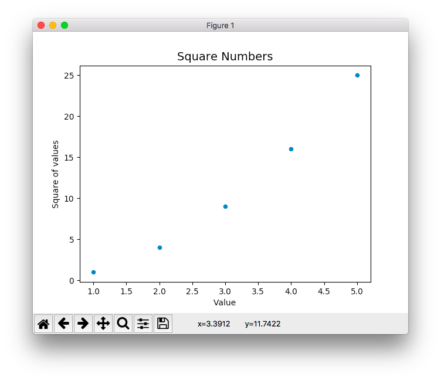

[TOC]

数据可视化
--- 

# 1.生成数据

> **数据可视化**指的是通过可视化表示来探索数据，它与**数据挖掘**紧密相关，而数据挖掘指的是使用代码来探索数据集的规律和关联。数据集可以是用一行代码就能表示的小型数字列表，也可以是数以吉字节的数据。

- matplotlib
它是一个数学绘图库，我们将使用它来制作简单的图表，如折线图和散点图。然后，我们将基于随机漫步概念生成一个更有趣的数据集——根据一系列随机决策生成的图表

- Pygal包
它专注于生成适合在数字设备上显示的图表。通过使用Pygal，可在用户与图表交互时突出元素以及调整其大小，还可轻松地调整整个图表的尺寸，使其适合在微型智能手表或巨型显示器上显示。我们将使用Pygal以各种方式探索掷骰子的结果。


## 1.安装matplotlib 


### 1.Linux 系统中安装 matplotlib

```shell
$ sudo apt-get install python3-matplotlib

#如果你使用的是Python 2.7，请执行如下命令：
$ sudo apt-get install python-matplotlib

#如果你安装了较新的Python版本，就必须安装matplotlib依赖的一些库：
$ sudo apt-get install python3.5-dev python3.5-tk tk-dev
$ sudo apt-get install libfreetype6-dev g++

#再使用pip来安装matplotlib：
$ pip install --user matplotlib
```


### 2.Mac 安装matplotlib

`$ pip install --user matplotlib`

> python3 使用pip3


## 2.绘制简单折线图

```python
# -*- coding: utf-8 -*-

import matplotlib.pyplot as plt

squares = [1,4,9,16,25]

plt.plot(squares)
plt.show()
```


> 效果

 


### 1.修改标签文字和线条粗细

```python

# -*- coding: utf-8 -*-

import matplotlib.pyplot as plt

squares = [1,4,9,16,25]

#设置线条粗细
plt.plot(squares,linewidth=1)

# 设置图表标题,并坐标轴添加标签
plt.title("Square Numbers",fontsize=14)
plt.xlabel("Value",fontsize=10)
plt.ylabel("Square of value",fontsize=10)

# 设置刻度标记大小
plt.tick_params(axis='both',labelsize=10)

# 绘制图形
plt.show()

```


> 效果

 


### 2.校正图形

> 设置x,y坐标的数值

```python
# -*- coding: utf-8 -*-

import matplotlib.pyplot as plt

input_values = [1,2,3,4,5]


squares = [1,4,9,16,25]

#设置线条粗细
plt.plot(input_values,squares,linewidth=1)

# 设置图表标题,并坐标轴添加标签
plt.title("Square Numbers",fontsize=14)
plt.xlabel("Value",fontsize=10)
plt.ylabel("Square of value",fontsize=10)

# 设置刻度标记大小
plt.tick_params(axis='both',labelsize=10)

# 绘制图形
plt.show()
```

> 效果 

 

### 3.使用scatter() 绘制散点图,并设置其样式

> 绘制散点图

```python
# -*- coding: utf-8 -*-
# 绘制散点图
import matplotlib.pyplot as plt

plt.scatter(2, 4)
plt.show()
```


> 效果

 


> 下面来设置输出的样式，使其更有趣：添加标题，给轴加上标签，并确保所有文本都大到能够看清

```python
# -*- coding: utf-8 -*-
# 绘制散点图
import matplotlib.pyplot as plt

plt.scatter(2, 4,s=20) # s=100 设置点的大小


# 设置标题,并添加标签
plt.title("Square Numbers",fontsize=14)
plt.xlabel("Value",fontsize=10)
plt.ylabel("Square of values",fontsize=10)

# 设置可读标记大小
plt.tick_params(axis='both',which='major',labelsize=10)


plt.show()
```


> 效果

 


### 4.使用scatter 绘制一系列点

```python
# -*- coding: utf-8 -*-
# 绘制散点图
import matplotlib.pyplot as plt

x_values = [1,2,3,4,5]
y_values =[1,4,9,16,25]


plt.scatter(x_values, y_values,s=20) # s=100 设置点的大小


# 设置标题,并添加标签
plt.title("Square Numbers",fontsize=14)
plt.xlabel("Value",fontsize=10)
plt.ylabel("Square of values",fontsize=10)

# 设置可读标记大小
plt.tick_params(axis='both',which='major',labelsize=10)


plt.show()
```
> 效果

 


### 5.自动计算数据

> 绘制1-10平方 的曲线

```python
# -*- coding: utf-8 -*-
# 绘制散点图
import matplotlib.pyplot as plt

x_values = list(range(1,101))
y_values =[x**2 for x in x_values]

plt.scatter(x_values, y_values,s=20) # s=100 设置点的大小


# 设置标题,并添加标签
plt.title("Square Numbers",fontsize=14)
plt.xlabel("Value",fontsize=10)
plt.ylabel("Square of values",fontsize=10)

# 设置可读标记大小
plt.tick_params(axis='both',which='major',labelsize=10)


plt.show()
```


> 效果

 


### 6.删除数据点的轮廓

> matplotlib允许你给散点图中的各个点指定颜色。默认为蓝色点和黑色轮廓，在散点图包含的
数据点不多时效果很好。但绘制很多点时，黑色轮廓可能会粘连在一起。要删除数据点的轮廓，
可在调用scatter()时传递实参edgecolor='none'：

` plt.scatter(x_values, y_values,edgecolor='none',s=20) # s=100 设置点的大小`


### 7.自定义颜色
- 使用`红,绿,蓝指定`

`plt.scatter(x_values, y_values,c='red',edgecolor='none',s=20) # s=100 设置点的大小`

- 使用reb指定颜色

`plt.scatter(x_values, y_values,c=(1,0,0),edgecolor='none',s=20) # s=100 设置点的大小`

> 效果

 

### 8.使用颜色映射

> 颜色映射（colormap）是一系列颜色，它们从起始颜色渐变到结束颜色。在可视化中，颜色
映射用于突出数据的规律，例如，你可能用较浅的颜色来显示较小的值，并使用较深的颜色来显
示较大的值。

- 渐变色映射
`plt.scatter(x_values, y_values,c=y_values,cmap=plt.cm.Blues,edgecolor='none',s=20) # s=100 设置点的大小`

> 效果

 


### 9.自动保存图像
> 保存图像

```python

# 保存图像
fig_name = 'squares_plot.png'
plt.savefig(fig_name,bbox_inches='tight') # 文件名:  bbox_inches: 将图标多余的空白区域剪切掉

plt.show()
```

> 图像

 


## 3.随机漫步

> 使用Python来生成随机漫步数据，再使用matplotlib以引人瞩目的方式将这些数据呈现出来。 随机漫步是这样行走得到的路径：每次行走都完全是随机的，没有明确的方向，结果是由一系列随机决策决定的。你可以这样认为，随机漫步就是蚂蚁在晕头转向的情况下，每次都沿随机的方向前行所经过的路径。

### 1.创建RandomWalk()类
> random_walk.py

```python
# -*- coding: utf-8 -*-

from random import choice 

class RandomWalk():
    """生成一个随机漫步数据类"""
    def __init__(self, num_points=5000):
        """初始化随机漫步的属性"""
        self.num_points = num_points
        # 所有的随机漫步都起始于(0,0)
        self.x_values = [0]
        self.y_values = [0]

    def fill_walk(self):
        """计算随机漫步包含的所有点"""
        # 不断漫步,知道列表达到指定的长度

        while len(self.x_values) < self.num_points:
            #决定前进方向以及沿着这个方向前进的距离
            x_direction = choice([1,-1])
            x_distance = choice([0,1,2,3,4])
            x_step = x_direction * x_distance

            y_direction = choice([1,-1])
            y_distance = choice([0,1,2,3,4])
            y_step = y_direction * y_distance

            # 拒绝原地踏步
            if x_step ==0 and y_step==0:
                continue

            # 计算下一个点的x,y
            next_x = self.x_values[-1] + x_step
            next_y = self.y_values[-1] + y_step

            self.x_values.append(next_x)
            self.y_values.append(next_y)
```

### 2.绘制漫步图

```python
# -*- coding: utf-8 -*-

# 随机漫步测试

import matplotlib.pyplot as plt

from random_walk import RandomWalk

# 创建一个随机漫步实例,并绘制其生成的序列点

rw = RandomWalk()
rw.fill_walk()

plt.scatter(rw.x_values,rw.y_values, s=5)
num_points = rw.num_points

plt.title("RandomWalk(" + str(num_points)+")")


plt.show()

```

> 效果

 

### 3.模拟多次随机漫步

> 使用while循环,模拟多次漫步


```python
# 随机漫步测试

import matplotlib.pyplot as plt

from random_walk import RandomWalk

# 创建一个随机漫步实例,并绘制其生成的序列点

# 模拟多次随机漫步- 只要程序处于活动状态,就不断模拟随机漫步

while True:

    rw = RandomWalk()
    rw.fill_walk()

    plt.scatter(rw.x_values,rw.y_values, s=5)
    num_points = rw.num_points
    plt.title("RandomWalk(" + str(num_points)+")")
    plt.show()

    keep_running = input("Make another walk?:(y/n):")
    if keep_running == 'n':
        break
```

### 4.设置随机漫步样式

定制图表，以突出每次漫步的重要特征，并让分散注意力的元素不那么显
眼。为此，我们确定要突出的元素，如漫步的起点、终点和经过的路径。接下来确定要使其不那
么显眼的元素，如刻度标记和标签。最终的结果是简单的可视化表示，清楚地指出了每次漫步经
过的路径。

#### 1.给点着色
使用颜色映射来指出漫步中各点的先后顺序，并删除每个点的黑色轮廓，让它们的颜
色更明显。为根据漫步中各点的先后顺序进行着色，我们传递参数c，并将其设置为一个列表，
其中包含各点的先后顺序。由于这些点是按顺序绘制的，因此给参数c指定的列表只需包含数字
1~5000，如下所示

> 代码

- 获取点数对应的坐标的list`point_index = list(range(rw.num_points))`
- 设置颜色`c=point_index`
- 隐藏边界`edgecolor='none'`


```python

# 创建一个随机漫步实例,并绘制其生成的序列点

# 模拟多次随机漫步- 只要程序处于活动状态,就不断模拟随机漫步

while True:

    rw = RandomWalk()
    rw.fill_walk()
    num_points = rw.num_points

    point_index = list(range(rw.num_points))


    plt.scatter(rw.x_values,rw.y_values,c=point_index,cmap=plt.cm.Blues,edgecolor='none', s=5)


    plt.title("RandomWalk(" + str(num_points)+")")
    plt.show()

    keep_running = input("Make another walk?:(y/n):")
    if keep_running == 'n':
        break

```


> 效果

 


#### 2.重新绘制起点和终点

> 代码

```python
import matplotlib.pyplot as plt

from random_walk import RandomWalk

# 创建一个随机漫步实例,并绘制其生成的序列点

# 模拟多次随机漫步- 只要程序处于活动状态,就不断模拟随机漫步

while True:

    rw = RandomWalk()
    rw.fill_walk()
    num_points = rw.num_points

    point_index = list(range(rw.num_points))

    #绘制起点和终点
    plt.scatter(rw.x_values,rw.y_values,c=point_index,cmap=plt.cm.Blues,edgecolors='none', s=5)

    #突出起点和终点
    plt.scatter(0, 0,c='green',edgecolors='none',s=50) #起点
    plt.scatter(rw.x_values[-1], rw.y_values[-1],c='red',edgecolors='none',s=50)


    plt.title("RandomWalk(" + str(num_points)+")")
    plt.show()

    keep_running = input("Make another walk?:(y/n):")
    if keep_running == 'n':
        break
```


> 效果

 

#### 3.隐藏坐标轴

```python

    #隐藏坐标轴
    plt.axes().get_xaxis().set_visible(False)
    plt.axes().get_yaxis().set_visible(False)
    
```


#### 4.增加点数

`   rw = RandomWalk(50000)`

> 设置点的大小 `s=1`


 


#### 5.调整尺寸,适合屏幕

```python
    #调整尺寸
    plt.figure(figsize=(10,6)) #指定宽,高,分辨率
    #或者指定dpi
    plt.figure(dpi=128,figsize=(10,6)) #指定宽,高,分辨率
```


> 效果

 


## 4.使用Pygal 掷骰子

使用Python可视化包Pygal来生成可缩放的矢量图形文件。对于需要在尺寸
不同的屏幕上显示的图表，这很有用，因为它们将自动缩放，以适合观看者的屏幕。如果你打算
以在线方式使用图表，请考虑使用Pygal来生成它们，这样它们在任何设备上显示时都会很美观。
在这个项目中，我们将对掷骰子的结果进行分析。掷6面的常规骰子时，可能出现的结果为
1~6点，且出现每种结果的可能性相同。然而，如果同时掷两个骰子，某些点数出现的可能性将
比其他点数大。为确定哪些点数出现的可能性最大，我们将生成一个表示掷骰子结果的数据集，
并根据结果绘制出一个图形。
在数学领域，常常利用掷骰子来解释各种数据分析，但它在赌场和其他博弈场景中也得到了
实际应用，在游戏《大富翁》以及众多角色扮演游戏中亦如此。


### 1.安装Pygal

> linux 

`pip3 install --user pygal`

> mac 

`pip3 install --user pygal`

> windows 

`python -m pip install --user pygal`

### 2.Pygal画廊
要了解使用Pygal可创建什么样的图表，请查看图表类型画廊：访问http://www.pygal.org/，单
击Documentation，再单击Chart types。每个示例都包含源代码，让你知道这些图表是如何生成

### 3.创建Die类
> 创建一个类,模拟掷筛子

```python
# -*- coding: utf-8 -*-
from random import randint

class Die( ):
    """表示一个筛子的类"""
    def __init__(self, num_sides=6):
        """默认为6点所在面"""
        self.num_sides = num_sides

    def roll(self):
        """返回一个1-6之间的随机数值"""
        return randint(1,self.num_sides)
        
```


> 测试结果

```python
# 测试掷骰子

from die import Die

#创建一个实例

die = Die()

# 随机掷几次,将结果存储在一个列表中

results = []
for roll_number in range(100):
    res = die.roll()
    results.append(res)

print(results)
print(len(results))
```


> 结果

```
[3, 4, 4, 1, 5, 5, 1, 2, 6, 4, 3, 3, 6, 5, 4, 1, 1, 4, 1, 5, 3, 4, 5, 3, 6, 6, 4, 4, 1, 2, 5, 1, 5, 4, 1, 1, 4, 3, 5, 4, 3, 3, 3, 4, 3, 1, 3, 4, 4, 2, 4, 3, 3, 5, 2, 6, 3, 2, 5, 4, 5, 5, 1, 4, 5, 2, 5, 2, 4, 6, 5, 2, 3, 6, 5, 1, 4, 5, 5, 2, 6, 4, 5, 4, 3, 2, 6, 5, 6, 3, 6, 5, 3, 1, 3, 3, 3, 4, 3, 4]
```

### 4.分析结果

> 计算每个点数出现的次数


```python
# 测试掷骰子

from die import Die

#创建一个实例

die = Die()

# 随机掷几次,将结果存储在一个列表中

results = []
for roll_number in range(1000):
    res = die.roll()
    results.append(res)


print("统计频率")

frequencies = []

for value in range(1,die.num_sides+1):
    freq = results.count(value)
    frequencies.append(freq)
    print(value)

print(frequencies)

```

> 结果

```language
[176, 167, 156, 161, 176, 164]
```


### 5.绘制直方图

```python

# 绘制直方图
import pygal

hist = pygal.Bar()

hist.title = "Result of rolling on D6 1000 times ."

hist.x_lables = ['1','2','3','4','5','6']
hist.x_title = "Result"

hist.y_title = "Frequency of Result"

hist.add('D6',frequencies)
hist.render_to_file('die_visul.svg')
```


> 在代码目录生成 .svg文件 使用浏览器打开后效果如下

 


### 6.同时掷两个骰子

```python
# -*- coding: utf-8 -*-
# 测试掷骰子
from die import Die
#同时掷两个骰子,统计两个骰子的点数的和
die_1 = Die()
die_2 = Die()
results = []
for roll_number in range(1000):
    res = die_1.roll() + die_2.roll()
    results.append(res)
# 分析结果
max_result = die_1.num_sides + die_2.num_sides
frequencies = []
for value  in range(2,max_result+1):
    freq = results.count(value)
    frequencies.append(freq)
print(frequencies)
# 绘制直方图
import pygal
hist = pygal.Bar()
hist.title = "Result of rolling on two D6 1000 times ."
hist.x_lables = ['2','3','4','5','6','7','8','9','10','11','12']
hist.x_title = "Result"
hist.y_title = "Frequency of Result"
hist.add('D6+D6',frequencies)
hist.render_to_file('die_visul.svg')
```

> 效果

 


### 7.同时投掷两个面数不同的筛子
```

#同时掷两个骰子,统计两个骰子的点数的和:面数分别为D6 D10
die_1 = Die()
die_2 = Die(10)
```

`hist.x_labels = ['2','3','4','5','6','7','8','9','10','11','12','13','14','15','16']`


> 效果

 


# 5.下载数据

> 在本章中，你将从网上下载数据，并对这些数据进行可视化。网
上的数据多得难以置信，且大多未经过仔细检查。如果能够对这些数
据进行分析，你就能发现别人没有发现的规律和关联。
我们将访问并可视化以两种常见格式存储的数据： CSV和JSON。
我们将使用Python模块csv来处理以CSV（逗号分隔的值）格式存储
的天气数据，找出两个不同地区在一段时间内的最高温度和最低温
度。然后，我们将使用matplotlib根据下载的数据创建一个图表，展
示两个不同地区的气温变化：阿拉斯加锡特卡和加利福尼亚死亡谷。
在本章的后面，我们将使用模块json来访问以JSON格式存储的人口
数据，并使用Pygal绘制一幅按国别划分的人口地图。
阅读本章后，你将能够处理各种类型和格式的数据集，并对如何创建复杂的图表有更
深入的认识。要处理各种真实世界的数据集，必须能够访问并可视化各种类型和格式的在
线数据。


## 1.CSV文件格式
> 要在文本文件中存储数据，最简单的方式是将数据作为一系列以逗号分隔的值（CSV）写入文件。这样的文件称为CSV文件。例如，下面是一行CSV格式的天气数据：

### 1.分析CSV头文件


> 读取 .csv文件中第一行

```python
import csv
file_name ='sitka_weather_07-2014.csv'

with open (file_name) as fobj:
    reader = csv.reader(fobj)
    header_row = next(reader) #读取reader 中的第一行

    print(header_row)
```


### 2.打印文件头及其位置

- 使用`enumerate(header_row) ` 获取每个元素的索引和值


```python
# -*- coding: utf-8 -*-
import csv
file_name ='sitka_weather_07-2014.csv'

with open (file_name) as fobj:
    reader = csv.reader(fobj)
    header_row = next(reader) #读取reader 中的第一行

    print(header_row)

    for index,column_header in enumerate(header_row):
        print(index,column_header)

Multi-line Code
```


> 效果

```
0 AKDT
1 Max TemperatureF
2 Mean TemperatureF
3 Min TemperatureF
4 Max Dew PointF
5 MeanDew PointF
6 Min DewpointF
7 Max Humidity
8  Mean Humidity
9  Min Humidity
10  Max Sea Level PressureIn
11  Mean Sea Level PressureIn
12  Min Sea Level PressureIn
13  Max VisibilityMiles
14  Mean VisibilityMiles
15  Min VisibilityMiles
16  Max Wind SpeedMPH
17  Mean Wind SpeedMPH
18  Max Gust SpeedMPH
19 PrecipitationIn
20  CloudCover
21  Events
22  WindDirDegrees

```


### 3.提取并读取数据
> 获取最高气温

```python

# -*- coding: utf-8 -*-
import csv
file_name ='sitka_weather_07-2014.csv'

with open (file_name) as fobj:
    reader = csv.reader(fobj)
    header_row = next(reader) #读取reader 中的第一行


    #获取最高气温
    highs = []
    for row  in reader:
        high = int(row[1])
        highs.append(high)
    print(highs)

```


### 4.绘制气温图标

```python
# -*- coding: utf-8 -*-
import csv
file_name ='sitka_weather_07-2014.csv'


highs = [] #存储每日最高气温


with open (file_name) as fobj:
    reader = csv.reader(fobj)
    header_row = next(reader) #读取reader 中的第一行


    #获取最高气温
    for row  in reader:
        high = int(row[1])
        highs.append(high)
    print(highs)


# 绘制气温图

from matplotlib import pyplot as plt

# fig = plt.figure(dpi=128,figsize=(10,6))
plt.plot(highs,c='red')


# 设置图表格式
plt.title("Daily high Temperatures ,July 2014", fontsize=14 )
plt.xlabel('',fontsize=10)
plt.ylabel("Temperature(F)",fontsize=10)

plt.tick_params(axis='both',which = 'major',labelsize=14)

plt.show()

```

> 每日最高气温

 


### 5.模块datetime

> 下面在图表中添加日期，使其更有用。在天气数据文件中，第一个日期在第二行：

- 导入datetime中的datetime 类 
- 调用strptime('日期字符串','日期格式')


| 实参 | 含义 |
| ------------- | ------------- |
%A | 星期的名称:Monday
%B | 月份名:January
%m | 用数字表示的月份(01-12)
%d | 用数字表示的某一天(01-31)
%Y | 四位的年份:2015
%y | 两位的年份:15
%H | 24进制小时:(00-23)
%I | 12进制小时:(01-12)
%p | am/pm
%M | 分钟数(00-59)
%S | 秒数(00-60)


> 测试

```python
>>> from datetime import datetime
>>> first_date = datetime.strptime('2014-7-1','%Y-%m-%d')
>>> print(first_date)
2014-07-01 00:00:00
```


### 6.图标中添加日期

- 日期转换:`current_date = datetime.strptime(row[0],'%Y-%m-%d')`
- 倾斜的日期标签`fig.autofmt_xdate()`

```python
# -*- coding: utf-8 -*-
import csv
# 绘制气温图
from matplotlib import pyplot as plt

# 添加日期
from datetime import datetime


file_name ='sitka_weather_07-2014.csv'


dates,highs = [] ,[]#存储 日期, 每日最高气温

with open (file_name) as fobj:
    reader = csv.reader(fobj)
    header_row = next(reader) #读取reader 中的第一行

    for row  in reader:
        # 读取日期
        current_date = datetime.strptime(row[0],'%Y-%m-%d')
        dates.append(current_date)
        print(current_date)

        #获取最高气温
        high = int(row[1])
        highs.append(high)


fig = plt.figure(dpi=128,figsize=(10,6))
plt.plot(dates,highs,c='red')

# 设置图表格式
plt.title("Daily high Temperatures ,July 2014", fontsize=14 )
plt.xlabel('',fontsize=10)
fig.autofmt_xdate()

plt.ylabel("Temperature(F)",fontsize=10)
plt.tick_params(axis='both',which = 'major',labelsize=14)

plt.show()
```


> 效果

 

### 7.涵盖更长时间

> 绘制2014年sitka整年的气温图


- 复制数据文件到源码目录
- 修改源码中文件名
- 修改title 

```python
# -*- coding: utf-8 -*-
import csv
# 绘制气温图
from matplotlib import pyplot as plt

# 添加日期
from datetime import datetime


# file_name ='sitka_weather_07-2014.csv' #七月份天气
file_name ='sitka_weather_2014.csv' # sitka整年的天气


dates,highs = [] ,[]#存储 日期, 每日最高气温

with open (file_name) as fobj:
    reader = csv.reader(fobj)
    header_row = next(reader) #读取reader 中的第一行

    for row  in reader:
        # 读取日期
        current_date = datetime.strptime(row[0],'%Y-%m-%d')
        dates.append(current_date)
        print(current_date)

        #获取最高气温
        high = int(row[1])
        highs.append(high)


fig = plt.figure(dpi=128,figsize=(10,6))
plt.plot(dates,highs,c='red')

# 设置图表格式
plt.title("Daily high Temperatures - 2014", fontsize=14 )
plt.xlabel('',fontsize=10)
fig.autofmt_xdate()

plt.ylabel("Temperature(F)",fontsize=10)
plt.tick_params(axis='both',which = 'major',labelsize=14)

plt.show()
```


> 全年气温

 

### 8.绘制最低气温
> 最低气温位于第四列列(索引下标为3)

AKST  |  Max TemperatureF  |  Mean TemperatureF  |  Min TemperatureF  |  Max Dew PointF  |  MeanDew PointF  |  Min DewpointF  |  Max Humidity  |   Mean Humidity  |   Min Humidity  |   Max Sea Level PressureIn  |   Mean Sea Level PressureIn  |   Min Sea Level PressureIn  |   Max VisibilityMiles  |   Mean VisibilityMiles  |   Min VisibilityMiles  |   Max Wind SpeedMPH  |   Mean Wind SpeedMPH  |   Max Gust SpeedMPH  |  PrecipitationIn  |   CloudCover  |   Events  |   WindDirDegrees
| ---- | ----- |--|--|--|--|---|---|---|---|---|---|---|---|---|---|---|---|---|---|---|
2014-1-1  |  46  |  42  |  37  |  40  |  38  |  36  |  97  |  86  |  76  |  29.95  |  29.77  |  29.57  |  10  |  8  |  2  |  25  |  14  |  36  |  0.69  |  8  |  Rain  |  138


```python
# -*- coding: utf-8 -*-
import csv
# 绘制气温图
from matplotlib import pyplot as plt
# 添加日期
from datetime import datetime
# file_name ='sitka_weather_07-2014.csv' #七月份天气
file_name ='sitka_weather_2014.csv' # sitka整年的天气
dates,highs,lows = [] ,[],[]#存储 日期, 每日最高气温,最低气温
with open (file_name) as fobj:
    reader = csv.reader(fobj)
    header_row = next(reader) #读取reader 中的第一行
    for row  in reader:
        # 读取日期
        current_date = datetime.strptime(row[0],'%Y-%m-%d')
        dates.append(current_date)
        print(current_date)
        #获取最高气温
        high = int(row[1])
        highs.append(high)
        # 读取最低气温
        low = int(row[3])
        lows.append(low)
fig = plt.figure(dpi=128,figsize=(10,6))
# 绘制最高气温
plt.plot(dates,highs,c='red')
# 绘制最低气温
plt.plot(dates,lows,c='blue')
# 设置图表格式
plt.title("Daily high and low Temperatures - 2014", fontsize=14 )
plt.xlabel('',fontsize=10)
fig.autofmt_xdate()
plt.ylabel("Temperature(F)",fontsize=10)
plt.tick_params(axis='both',which = 'major',labelsize=14)
plt.show()
```


> 最高气温和最低气温

- 红色 最高气温
- 蓝色 最低气温

 


### 9.绘制图标区域着色

- fill_between() : 接收一个x系列的值和两个y系列的值

> 区域着色

`plt.fill_between(dates, highs,lows,facecolor='blue',alpha=0.3)` 

> 效果

 


### 10.检查数据异常

```python
with open (file_name) as fobj:
    reader = csv.reader(fobj)
    header_row = next(reader) #读取reader 中的第一行

    for row  in reader:

        try:
            # 读取日期
            current_date = datetime.strptime(row[0],'%Y-%m-%d')
            #获取最高气温
            high = int(row[1])
            # 读取最低气温
            low = int(row[3])
        except ValueError :
            print(current_date,"missing data")
        else:
            dates.append(current_date)
            highs.append(high)
            lows.append(low)
```

## 2.绘制世界人口地图 : json格式

> population_data.json 数据文件

### 1.提取世界人口数据

- 提取世界人口数据
- 将字符串转换为整数(如果字符串为浮点数,会报错)
- 将字符串转换为浮点数->转换为整数

```python
# -*- coding: utf-8 -*-
# 世界人口

import json


# 将数据加载到一个列表中

file_name = "population_data.json"

with open(file_name) as fobj:
    pop_data = json.load(fobj) #读取json数据文件中的数据


#打印每个国家 2010年人口 数量  

for pop_dict in pop_data:
    if pop_dict['Year'] == '2010':

        country_name = pop_dict['Country Name']
        country_code = pop_dict['Country Code']
        country_pop = int(float(pop_dict['Value']))

        print(country_name+":"+str(country_pop))


```


### 2.提取两个字母的国别码

> 制作地图前，还需要解决数据存在的最后一个问题。 Pygal中的地图制作工具要求数据为特
定的格式：用国别码表示国家，以及用数字表示人口数量。处理地理政治数据时，经常需要用到
几个标准化国别码集。 population_data.json中包含的是三个字母的国别码，但Pygal使用两个字母
的国别码。我们需要想办法根据国家名获取两个字母的国别码。
Pygal使用的国别码存储在模块i18n（internationalization的缩写）中。字典COUNTRIES包含的
键和值分别为两个字母的国别码和国家名。要查看这些国别码，可从模块i18n中导入这个字典，
并打印其键和值：


> 导入`pip3 install pygal_maps_world` (i18n 已经替换为pygal_maps_world) 

- http://www.jianshu.com/p/d93bb7e6fb6e


```python
from  pygal.maps.world import COUNTRIES

# 
for  country_code in sorted(COUNTRIES.keys()):
    print(country_code ,COUNTRIES[country_code])
```


> 效果

```
ad Andorra
ae United Arab Emirates
af Afghanistan
al Albania
am Armenia
ao Angola
aq Antarctica
ar Argentina
at Austria
au Australia
az Azerbaijan
ba Bosnia and Herzegovina
bd Bangladesh
be Belgium
bf Burkina Faso
bg Bulgaria
bh Bahrain
......
```


> 编写函数,获取指定国家名对应的pygal中的两个字母的国别码

```python
from  pygal.maps.world import COUNTRIES

# 定义一个函数,在COUNTRIES中查找并返回国别码

def get_country_code(country_name):
    """根据指定的国家,返回Pygal使用的两位的国别码"""
    for code ,name in COUNTRIES.items():
        if name ==country_name:
            return code
    # 如果没有找到,返回None
    return None


# 测试

china_code = get_country_code("China")
print(china_code)
```

> 提供json数据中国家对应的国别码


```python
import json

#导入国别码转换模块
from country_codes import get_country_code


# 将数据加载到一个列表中

file_name = "population_data.json"

with open(file_name) as fobj:
    pop_data = json.load(fobj) #读取json数据文件中的数据


#打印每个国家 2010年人口 数量  

for pop_dict in pop_data:
    if pop_dict['Year'] == '2010':

        country_name = pop_dict['Country Name']
        country_code = pop_dict['Country Code']
        country_pop = int(float(pop_dict['Value']))

        country_code_pygal = get_country_code(country_name) #根据国家名,返回pygal中对应的两位国别码

        if country_code_pygal:
            print(country_code_pygal +":"+country_name+":" + str(country_pop))
        else:
            print("ERROR -" + country_name)
```

### 3.绘制世界人口地图

> 有了国别码后，制作世界地图易如反掌。 Pygal提供了图表类型Worldmap，可帮助你制作呈现
各国数据的世界地图。为演示如何使用Worldmap，我们来创建一个突出北美、中美和南美的简单
地图


- 北美世界地图`americas.py`

```python
# -*- coding: utf-8 -*-
# 突出北美,中美,南美的地图

import pygal.maps.world


wm = pygal.maps.world.World()

wm.add('North America',['ca','mx','us'])
wm.add('Central America',['bz','cr','gt','hn','ni','pa','sv'])
wm.add('South America',['ar','bo','br','cl','co','ec','gf','gy','pe','py','sr','uy','ve'])

wm.render_to_file('americas.svg')
```

- 使用浏览器打开'americas.svg'

 


### 4.在世界地图上显示数据
> 为练习在地图上呈现数字数据，我们来创建一幅地图，显示三个北美国家的人口数量：

```python
# -*- coding: utf-8 -*-
# 北美三个国家的人口数量
# import pygal
# wm = pygal.Worldmap()

# 导入世界地图包
import pygal.maps.world
wm = pygal.maps.world.World()

# 设置标题
wm.title = 'Populations of Countries in North America'

# 添加绘制地区和数据
wm.add("North America ",{'ca':34126000,'us':30934900,'mx':113423000})

# 保存到文件
wm.render_to_file('na_populations.svg')
```


> 使用浏览器打开 'na_populations.svg'

 

### 5.绘制世界人口地图 

```python
 -*- coding: utf-8 -*-
# 世界人口
import json
#导入国别码转换模块
from country_codes import get_country_code
# 将数据加载到一个列表中
file_name = "population_data.json"
with open(file_name) as fobj:
    pop_data = json.load(fobj) #读取json数据文件中的数据
# 创建一个包含人口数量的字典
cc_populations ={}
for pop_dict in pop_data:
    if pop_dict['Year'] == '2010':
        country_name = pop_dict['Country Name']
        country_code = pop_dict['Country Code']
        country_pop = int(float(pop_dict['Value']))
        country_code_pygal = get_country_code(country_name) #根据国家名,返回pygal中对应的两位国别码
        if country_code_pygal:
            # print(country_code_pygal +":"+country_name+":" + str(country_pop))
            cc_populations[country_code_pygal] = country_pop  # 将国家代码和人口存入词典
        else:
            print("ERROR -" + country_name)
# 绘制世界人口地图
# 导入世界地图包
import pygal.maps.world
wm = pygal.maps.world.World()
wm.title = "Wrold Populations in 2010 by Country"
wm.add("2010",cc_populations)
wm.render_to_file("world_populations.svg")
```


> 使用个浏览器打开

 

### 6.根据人口将国家分组

> 印度和中国的人口比其他国家多得多，但在当前的地图中，它们的颜色与其他国家差别较小。
中国和印度的人口都超过了10亿，接下来人口最多的国家是美国，但只有大约3亿。下面不将所
有国家都作为一个编组，而是根据人口数量分成三组——少于1000万的、介于1000万和10亿之间
的以及超过10亿的：


```python
# -*- coding: utf-8 -*-
# 世界人口

import json

#导入国别码转换模块
from country_codes import get_country_code

# 将数据加载到一个列表中

file_name = "population_data.json"

with open(file_name) as fobj:
    pop_data = json.load(fobj) #读取json数据文件中的数据


# 创建一个包含人口数量的字典
cc_populations ={}


for pop_dict in pop_data:
    if pop_dict['Year'] == '2010':

        country_name = pop_dict['Country Name']
        country_code = pop_dict['Country Code']
        country_pop = int(float(pop_dict['Value']))

        country_code_pygal = get_country_code(country_name) #根据国家名,返回pygal中对应的两位国别码

        if country_code_pygal:
            # print(country_code_pygal +":"+country_name+":" + str(country_pop))
            cc_populations[country_code_pygal] = country_pop  # 将国家代码和人口存入词典
        else:
            print("ERROR -" + country_name)


# 根据人口数量,将国家分为三组 
cc_pops_1,cc_pops_2,cc_pops_3 = {},{},{}


for cc,pop in cc_populations.items():
    if pop <1000*10000: #小于1000万
        cc_pops_1[cc] = pop
    elif pop <10*10000*10000 : # 1000万到10亿
        cc_pops_2[cc] = pop
    else: #大于10亿
        cc_pops_3[cc] = pop 

print(len(cc_pops_1),len(cc_pops_2),len(cc_pops_3))
print(cc_pops_3)
# 绘制世界人口地图
# 导入世界地图包
import pygal.maps.world
wm = pygal.maps.world.World()

wm.title = "Wrold Populations in 2010 by Country"

wm.add("0-10m",cc_pops_1)
wm.add("10m-1bn",cc_pops_2)
wm.add(">1bn",cc_pops_3)

wm.render_to_file("world_populations.svg")


```


> 分组

 


